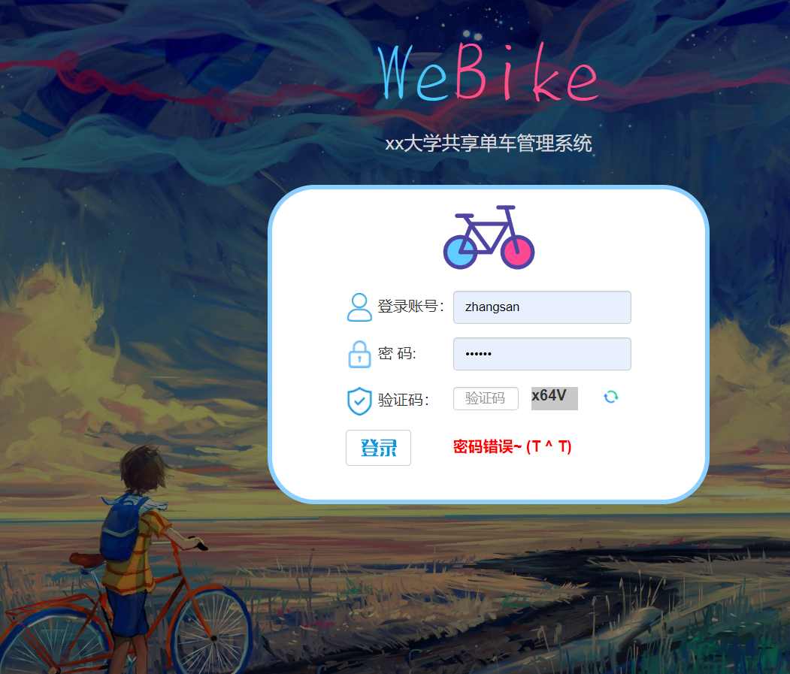
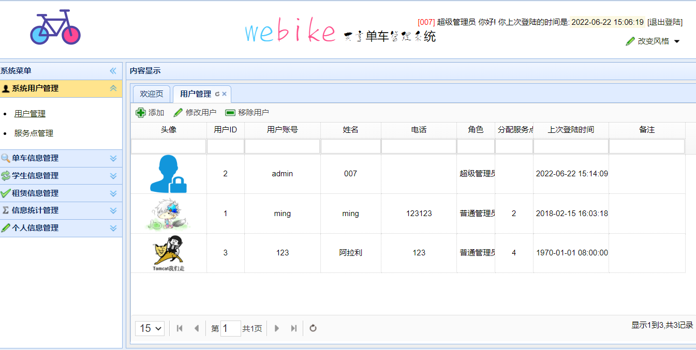
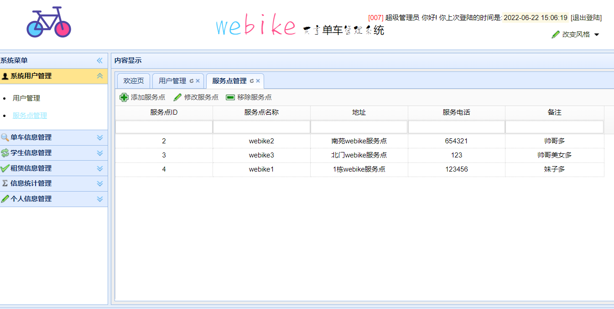
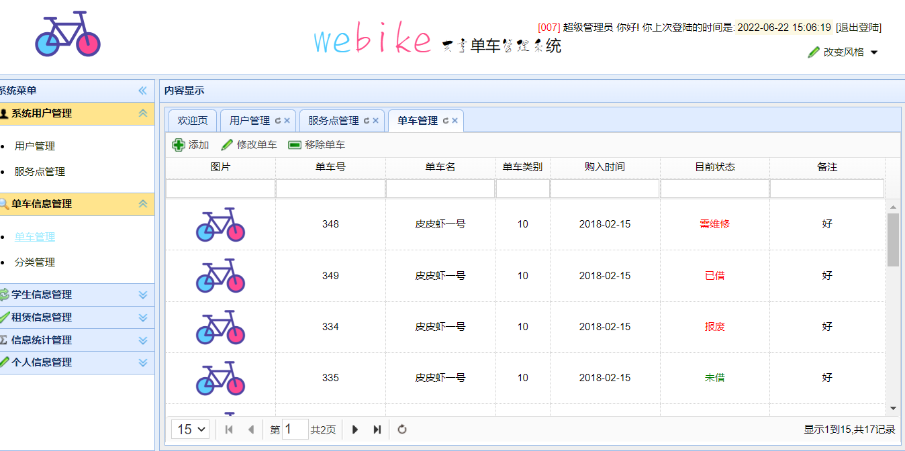
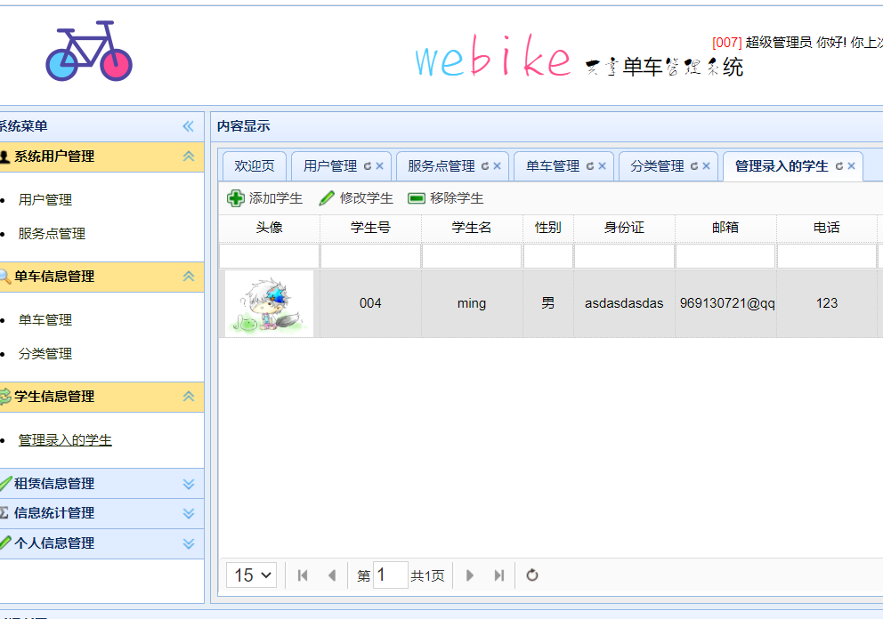
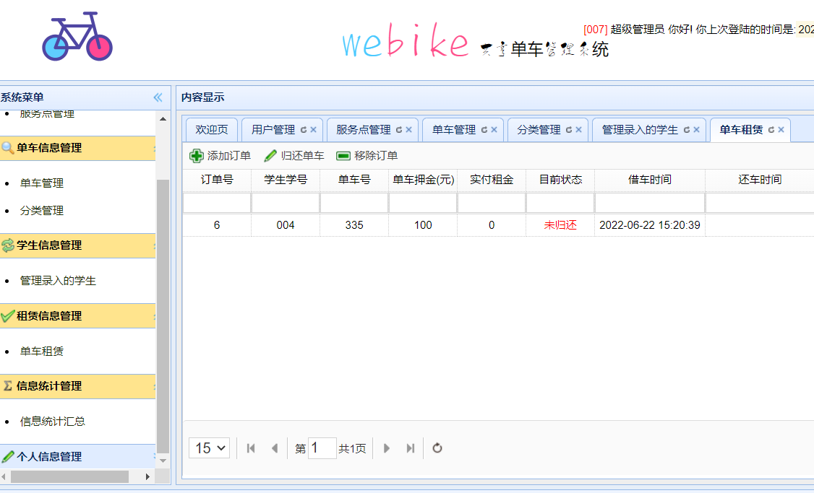
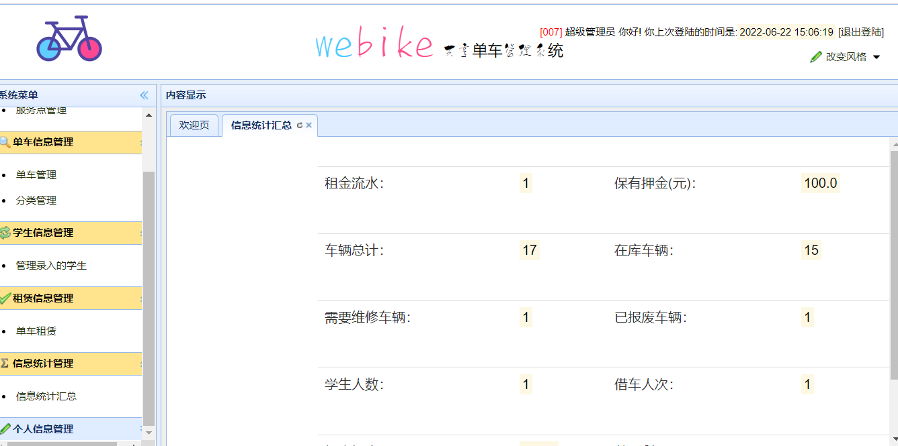
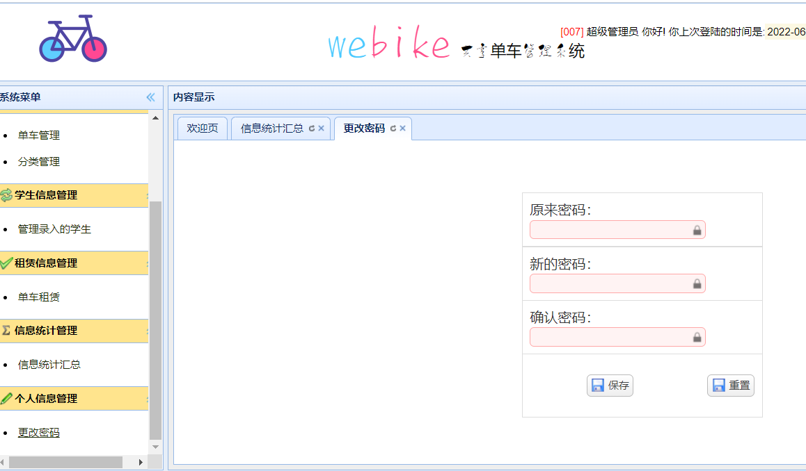

### 作者QQ：1556708905(支持修改、 部署调试、 支持代做毕设)

#### 支持代做任何毕设论、接网站建设、小程序、H5、APP、各种系统等

**毕业设计所有选题地址 [https://github.com/zhengjianzhong0107/allProject](https://github.com/zhengjianzhong0107/allProject)**

**博客地址：[https://blog.csdn.net/2303_76227485/article/details/128701968](https://blog.csdn.net/2303_76227485/article/details/128701968)**

**视频演示：[https://www.bilibili.com/video/BV1kh411P7vm/](https://www.bilibili.com/video/BV1kh411P7vm/)**

## 基于ssm高校共享单车管理系统 (源代码+数据库)

## 一、系统介绍

##### 用户管理，服务点管理，单车管理，分类管理，学生管理、学生信息管理，租赁信息管理、统计

## 二、所用技术

- #### 后台技术选型
  
  * Spring
  * SpringMVC
  * Mybatis
  * jsp
  * mysql

- #### 前端技术选型
  
  * EasyUI

## 三、环境介绍

基础环境 :IDEA/eclipse, JDK 1.8, Mysql5.7,tomcat8,Maven

所有项目以及源代码本人均调试运行无问题 可支持远程调试运行

## 四、页面截图

## 五、浏览地址

http://localhost:8989/webike/admin/login
账号密码：admin/123

## 六、安装教程

1. 使用Navicat或者其它工具、在mysql中创建对应名称的数据库、并导入项目的sql文件；
2. 使用IDEA/Eclipse导入项目，若为maven项目请选择maven，导入成功后请执行maven clean;maven install命令
3. 修改src\main\resources里面的jdbc.properties 里面的数据库配置
4. 将项目加入到tomcat容器里面，启动项目 

 
